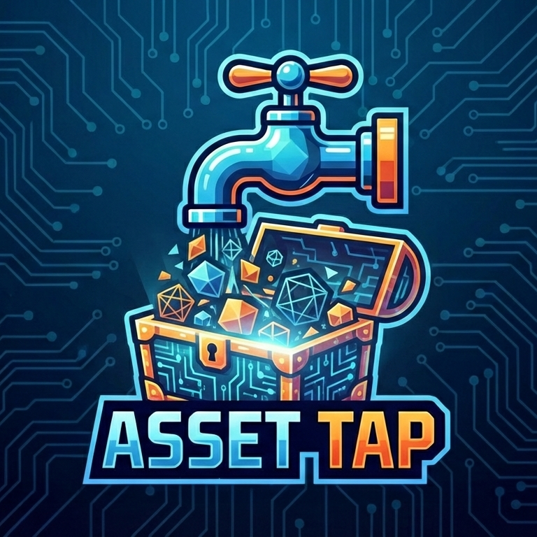

<div align="center">
  

# Asset Tap

**Generate 3D models from text prompts**

[](https://github.com/nightandwknd/asset-tap/actions/workflows/release.yaml)
[](https://github.com/nightandwknd/asset-tap/releases/latest)
[](LICENSE)
[](https://github.com/nightandwknd/asset-tap/releases/latest)
[](https://www.rust-lang.org/)

</div>

Text prompt → AI image → 3D model → FBX export

## Download & Install

Download the latest release for your platform from [GitHub Releases](https://github.com/nightandwknd/asset-tap/releases/latest).

### macOS

**DMG Installer (Universal — Intel + Apple Silicon)**

1. Download [AssetTap-macos.dmg](https://github.com/nightandwknd/asset-tap/releases/latest/download/AssetTap-macos.dmg)
2. Open the DMG file
3. Drag **AssetTap** to your Applications folder
4. **First launch:** macOS will block the app because it isn't signed with an Apple Developer certificate yet. To allow it:
   - Open **System Settings → Privacy & Security**, scroll down, and click **Open Anyway** next to the "Asset Tap.app was blocked" message
   - Or run this once in Terminal:
     ```bash
     xattr -cr "/Applications/Asset Tap.app"
     ```
5. Launch from Applications or Spotlight

**CLI Setup (Optional)**

The CLI is bundled inside the app. To use it from the terminal:

```bash
sudo ln -sf "/Applications/Asset Tap.app/Contents/MacOS/asset-tap" /usr/local/bin/asset-tap
```

Or download the standalone CLI:

```bash
curl -LO https://github.com/nightandwknd/asset-tap/releases/latest/download/asset-tap-cli-macos.tar.gz
tar -xzf asset-tap-cli-macos.tar.gz
sudo mv asset-tap /usr/local/bin/
```

### Windows

1. Download [asset-tap-windows-setup.exe](https://github.com/nightandwknd/asset-tap/releases/latest/download/asset-tap-windows-setup.exe)
2. Run the installer
3. Launch from the Start Menu

Or download the standalone CLI: [asset-tap-cli-windows.zip](https://github.com/nightandwknd/asset-tap/releases/latest/download/asset-tap-cli-windows.zip)

### Linux

**.deb (Debian/Ubuntu)**

```bash
curl -LO https://github.com/nightandwknd/asset-tap/releases/latest/download/asset-tap-linux-amd64.deb
sudo dpkg -i asset-tap-linux-amd64.deb
```

**AppImage (Universal)**

```bash
curl -LO https://github.com/nightandwknd/asset-tap/releases/latest/download/asset-tap-linux-x86_64.AppImage
chmod +x asset-tap-linux-x86_64.AppImage
./asset-tap-linux-x86_64.AppImage
```

Or download the standalone CLI: [asset-tap-cli-linux.tar.gz](https://github.com/nightandwknd/asset-tap/releases/latest/download/asset-tap-cli-linux.tar.gz)

### Build from Source

```bash
git clone https://github.com/nightandwknd/asset-tap.git
cd asset-tap
make build
```

See [docs/DEVELOPMENT.md](docs/DEVELOPMENT.md) for detailed setup instructions.

## Quick Start

### 1. Get an API Key

Asset Tap ships with pre-configured provider integrations. Choose one or more AI providers that offer text-to-image and image-to-3D capabilities:

**Included provider:**

- [fal.ai](https://fal.ai) - [Get API Key](https://fal.ai/dashboard/keys)

You can also add your own providers by creating YAML configuration files (see provider configs in `providers/` directory).

### 2. Launch the Application

Open **Asset Tap** from your Applications folder, Start Menu, or app launcher. On first launch, you'll be prompted to configure your API key.

### 3. Generate Your First Model

1. Enter a text prompt (e.g., "a cowboy ninja with a leather duster, bandana mask, and dual katanas on the back")
2. Select your provider and models
3. Click **Generate**
4. Preview your 3D model in the built-in viewer
5. Export as GLB or FBX

## Features

- **Built-in 3D Viewer** - Preview and inspect models before export
- **Multiple AI Models** - Choose the best text-to-image and image-to-3D models for your workflow
- **Template System** - Create and reuse prompt templates
- **FBX Export** - Automatic conversion via Blender (optional)
- **Library Management** - Browse and organize your generated models
- **Real-time Progress** - Watch generation stages in real-time

## CLI Usage

For automation and scripting:

```bash
# Basic generation
asset-tap --yes "a wooden treasure chest"

# Specify provider and models
asset-tap -p fal.ai --image-model fal-ai/nano-banana-2 -y "a dragon"

# Use existing image
asset-tap --yes --image "photo.png"

# List available providers and models
asset-tap --list-providers
```

See the [documentation site](https://assettap.dev/docs/) for advanced usage.

## Output

Generated assets are saved to timestamped directories:

```
output/
└── 1984-01-24_120000/
    ├── bundle.json      # Metadata (prompt, models, stats)
    ├── image.png        # AI-generated image
    ├── model.glb        # 3D model (GLB format)
    ├── model.fbx        # FBX export (if Blender installed)
    └── textures/        # Extracted textures
```

## Available Models

### Text-to-Image

| Model               | Description                                                      |
| ------------------- | ---------------------------------------------------------------- |
| **Nano Banana 2**   | Gemini 3.1 Flash Image — reasoning-guided generation _(default)_ |
| **Nano Banana**     | Google Imagen 3-based — fast and affordable                      |
| **Nano Banana Pro** | Premium Imagen 3 — higher quality with aspect ratio control      |
| **FLUX.2 Dev**      | Open-source FLUX.2 with tunable guidance and steps               |
| **FLUX.2 Pro**      | Premium FLUX.2 — best quality, zero-config                       |

### Image-to-3D

| Model             | Description                                                 |
| ----------------- | ----------------------------------------------------------- |
| **TRELLIS 2**     | Native 3D generative model — fast and versatile _(default)_ |
| **Hunyuan3D Pro** | Tencent Hunyuan3D v3.1 Pro — high quality 3D generation     |
| **Meshy v6**      | 3D models with PBR textures                                 |

All models are provided by [fal.ai](https://fal.ai). See [Provider Documentation](docs/architecture/PROVIDERS.md) for complete details and custom provider setup.

## Requirements

- **Operating System**: macOS 10.15+, Linux (glibc 2.31+), Windows 10+
- **AI Provider**: API key from [fal.ai](https://fal.ai/dashboard/keys)
- **Blender** (optional): For FBX export
  - macOS: [Blender.org](https://www.blender.org/download/)
  - Linux: `sudo apt install blender` or Snap/Flatpak
  - Windows: [Blender.org](https://www.blender.org/download/)

## Documentation

### User Guides

- [Bundle Structure](docs/guides/BUNDLE_STRUCTURE.md) - Understanding output files

### Technical Documentation

- [Provider System](docs/architecture/PROVIDERS.md) - How providers work
- [Provider Schema](docs/guides/PROVIDER_SCHEMA.md) - Create custom providers
- [Development Guide](docs/DEVELOPMENT.md) - Developer setup and guidelines
- [Packaging Guide](docs/PACKAGING.md) - Building installers for distribution

## Troubleshooting

**macOS: "Asset Tap.app" Not Opened / "cannot be verified"**

This is required once because the app is not yet signed with an Apple Developer certificate. Either:

- Open **System Settings → Privacy & Security**, scroll down, and click **Open Anyway**
- Or run `xattr -cr "/Applications/Asset Tap.app"` in Terminal

**"Provider not found"**

- Verify your API key is set correctly
- Check that environment variable matches provider requirements
- Settings → API Keys in the GUI

**"Blender not found"**

- FBX export requires Blender to be installed
- GUI will show FBX export as unavailable
- GLB models work without Blender

**Model generation fails**

- Check your API key has sufficient credits
- Verify network connection
- Check provider status pages

## License

This project is licensed under the GNU Affero General Public License v3.0 (AGPL-3.0) - see [LICENSE](LICENSE) file for details.

The AGPL-3.0 is a strong copyleft license that requires anyone who modifies and runs this software as a network service to make their source code available.

## For Developers

See [docs/DEVELOPMENT.md](docs/DEVELOPMENT.md) for setup, building from source, and contribution workflow.

## Support

- **Issues**: [GitHub Issues](https://github.com/nightandwknd/asset-tap/issues)
- **Discussions**: [GitHub Discussions](https://github.com/nightandwknd/asset-tap/discussions)
- **Documentation**: [docs/](docs/)
