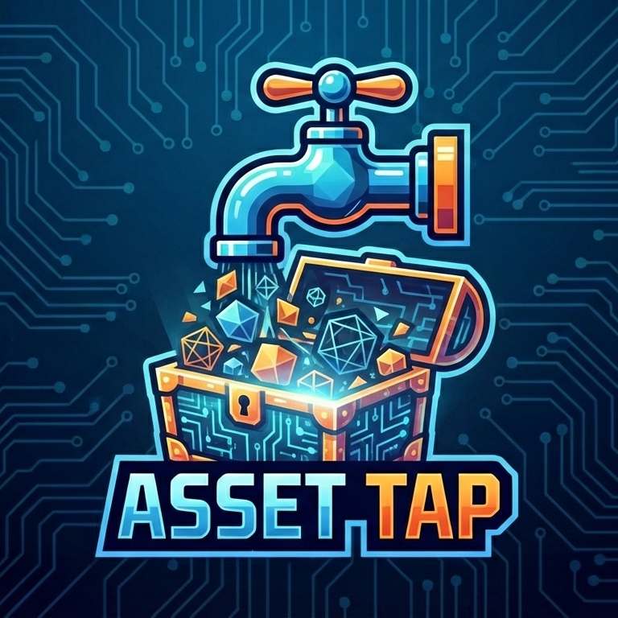

<div align="center">
  

# Asset Tap

**Generate 3D models from text prompts**

[](https://github.com/nightandwknd/asset-tap/actions/workflows/release.yaml)
[](https://github.com/nightandwknd/asset-tap/releases/latest)
[](LICENSE-MIT)
[](https://github.com/nightandwknd/asset-tap/releases/latest)
[](https://www.rust-lang.org/)

</div>

Text prompt → AI image → 3D model → FBX export

## Install

Two things you can install — pick what you need (or both): the **CLI** for
your terminal, and the **desktop app** (GUI).

### Install the CLI (macOS / Linux)

```bash
curl -fsSL https://assettap.dev/install | bash
```

Installs `asset-tap` and the `atap` alias to `~/.local/bin`, checksum-verified against the release's `SHA256SUMS`. Pin a version with `... | bash -s -- v26.8.12`; change the destination with `ASSET_TAP_INSTALL_DIR=/some/bin`. On Windows (PowerShell):

```powershell
irm https://assettap.dev/install.ps1 | iex
```

Installs `asset-tap.exe` and the `atap` alias to `%LOCALAPPDATA%\AssetTap\bin` and adds it to your user `PATH`, checksum-verified. Pin with `$env:ASSET_TAP_VERSION = "v26.8.12"` first.

Then:

```bash
asset-tap auth set fal.ai        # or: asset-tap auth set meshy
asset-tap "a stylized sci-fi crate"
```

### Install the Desktop App

Download your platform's installer from [GitHub Releases](https://github.com/nightandwknd/asset-tap/releases/latest).

**macOS (Universal — Intel + Apple Silicon)**

1. Download [AssetTap-macos.dmg](https://github.com/nightandwknd/asset-tap/releases/latest/download/AssetTap-macos.dmg)
2. Open the DMG file
3. Drag **AssetTap** to your Applications folder
4. Launch from Applications or Spotlight

The app carries its own copy of the CLI internally; for terminal use, run the CLI install above.

**Windows**

1. Download [asset-tap-windows-setup.exe](https://github.com/nightandwknd/asset-tap/releases/latest/download/asset-tap-windows-setup.exe)
2. Run the installer
3. Launch from the Start Menu

### Linux

**.deb (Debian/Ubuntu)**

```bash
curl -LO https://github.com/nightandwknd/asset-tap/releases/latest/download/asset-tap-linux-amd64.deb
sudo dpkg -i asset-tap-linux-amd64.deb
```

Installs `asset-tap-gui`, `asset-tap`, and the `atap` alias system-wide.

**AppImage (Universal)**

```bash
curl -LO https://github.com/nightandwknd/asset-tap/releases/latest/download/asset-tap-linux-x86_64.AppImage
chmod +x asset-tap-linux-x86_64.AppImage
./asset-tap-linux-x86_64.AppImage
```

The AppImage is the GUI only — pair it with the CLI install above for terminal use.

### Build from Source

```bash
git clone https://github.com/nightandwknd/asset-tap.git
cd asset-tap
make build
```

See [docs/DEVELOPMENT.md](docs/DEVELOPMENT.md) for detailed setup instructions.

## Quick Start

### 1. Get an API Key

Asset Tap ships with pre-configured provider integrations. Choose one or more AI providers that offer text-to-image and image-to-3D capabilities:

**Included providers** — pick either one (a single key runs the full pipeline):

- [fal.ai](https://fal.ai) - [Get API Key](https://fal.ai/dashboard/keys). Pay-per-generation.
- [Meshy AI](https://www.meshy.ai) - [Get API Key](https://www.meshy.ai/settings/api). Subscription + credits.

You can also add your own providers by creating YAML configuration files (see provider configs in `providers/` directory).

### 2. Launch the Application

Open **Asset Tap** from your Applications folder, Start Menu, or app launcher. On first launch, you'll be prompted to configure your API key.

### 3. Generate Your First Model

1. Enter a text prompt (e.g., "a cowboy ninja with a leather duster, bandana mask, and dual katanas on the back")
2. Select your provider and models
3. Click **Generate**
4. Preview your 3D model in the built-in viewer
5. Export as GLB or FBX

## Features

- **Built-in 3D Viewer** - Preview and inspect models before export
- **Multiple AI Models** - Choose the best text-to-image and image-to-3D models for your workflow
- **Template System** - Create and reuse prompt templates
- **Image-only mode** - Stop after text-to-image when you just want a 2D result
- **Reuse past images** - Right-click any library item or preview image and pick "Use for Generation" to skip text-to-image on the next run
- **FBX Export** - Automatic conversion via Blender (optional)
- **Library Management** - Browse and organize your generated models
- **Real-time Progress** - Watch generation stages in real-time

## CLI Usage

Release archives also install **`atap`**, a short alias for `asset-tap` (a
symlink on macOS/Linux, `atap.cmd` on Windows). Everything below works with
either name; `asset-tap` is the canonical one. Source builds don't ship the
alias — add your own (`alias atap=asset-tap`).

For automation and scripting:

```bash
# Basic generation
asset-tap "a wooden treasure chest"

# Specify provider and models
asset-tap -p fal.ai --image-model fal-ai/nano-banana-2 "a dragon"

# Use an existing image instead of generating one
asset-tap --image "photo.png"

# Stop after image generation — produce an image-only bundle with no 3D model
asset-tap --image-only -y "a wooden treasure chest"

# List available providers and models
asset-tap --list-providers

# Auto-confirm the image approval step (only matters if you have approval enabled)
asset-tap -y "a wooden treasure chest"

# Store an API key without launching the GUI (prompts with no echo, or pipe it)
asset-tap auth set fal.ai
echo "$FAL_KEY" | asset-tap auth set fal.ai
asset-tap auth list

# Machine-readable output for tooling: NDJSON events on stdout, one per line
asset-tap --json "a wooden treasure chest"

# Machine-readable model/template catalog (single JSON document)
asset-tap --list-providers --json
asset-tap --list --json
```

`--json` mode is a stable wire-format contract for external tools (e.g. the
editor integrations) that drive `asset-tap` as a subprocess. It emits newline-delimited
JSON events on stdout (all human logs go to stderr), ends with a single
authoritative `result` event, and uses differentiated exit codes. The full
contract is in [docs/CLI_MACHINE_INTERFACE.md](docs/CLI_MACHINE_INTERFACE.md).

**Driving asset-tap from an AI coding agent** (Claude Code, Cursor, Codex, …)?
The CLI is built to be agent-legible — `--help`, `--machine-help`, `--list --json`,
`auth list --json`, and stable exit codes are the whole interface. Start with
[AGENTS.md](AGENTS.md). Hosts without a shell (Claude Desktop, Cursor) can add
`asset-tap mcp` as an MCP server — see [docs/MCP.md](docs/MCP.md).

See the [documentation site](https://assettap.dev/docs/) for advanced usage.

## Output

Generated assets are saved to timestamped directories:

```
output/
└── 1984-01-24_120000/
    ├── bundle.json      # Metadata (prompt, models, stats)
    ├── image.png        # AI-generated image
    ├── model.glb        # 3D model (GLB format)
    ├── model.fbx        # FBX export (if Blender installed)
    └── textures/        # Extracted textures
```

## Available Models

### Text-to-Image

| Model               | Provider | Description                                                      |
| ------------------- | -------- | ---------------------------------------------------------------- |
| **Nano Banana 2**   | fal.ai   | Gemini 3.1 Flash Image — reasoning-guided generation _(default)_ |
| **Nano Banana**     | fal.ai   | Google Imagen 3-based — fast and affordable                      |
| **Nano Banana Pro** | fal.ai   | Premium Imagen 3 — higher quality with aspect ratio control      |
| **FLUX.2 Dev**      | fal.ai   | Open-source FLUX.2 with tunable guidance and steps               |
| **FLUX.2 Pro**      | fal.ai   | Premium FLUX.2 — best quality, zero-config                       |
| **Nano Banana**     | Meshy    | Meshy's standard text-to-image tier                              |
| **Nano Banana Pro** | Meshy    | Meshy's higher-quality text-to-image tier                        |

### Image-to-3D

| Model              | Provider | Description                                                 |
| ------------------ | -------- | ----------------------------------------------------------- |
| **TRELLIS 2**      | fal.ai   | Native 3D generative model — fast and versatile _(default)_ |
| **Hunyuan3D Pro**  | fal.ai   | Tencent Hunyuan3D v3.1 Pro — high quality 3D generation     |
| **Meshy v7**       | fal.ai   | Meshy 7 through fal — pay-per-call billing                  |
| **Meshy v6**       | fal.ai   | Meshy 6 through fal — pay-per-call billing                  |
| **Meshy v7**       | Meshy    | Meshy 7 — newest generation, supports Ultra mode            |
| **Smart Topology** | Meshy    | Meshy T2 — clean topology, game-ready face counts           |
| **Meshy v6**       | Meshy    | Meshy 6 — production-ready 3D with PBR textures             |
| **Meshy v5**       | Meshy    | Previous generation, lower credit cost                      |

Models are provided by [fal.ai](https://fal.ai) and [Meshy AI](https://www.meshy.ai). See [Provider Documentation](docs/architecture/PROVIDERS.md) for complete details and custom provider setup.

## Requirements

- **Operating System**: macOS 10.15+, Linux (glibc 2.31+), Windows 10+
- **AI Provider**: API key from [fal.ai](https://fal.ai/dashboard/keys) or [Meshy](https://www.meshy.ai/settings/api) (one is enough)
- **Blender** (optional): For FBX export
  - macOS: [Blender.org](https://www.blender.org/download/)
  - Linux: `sudo apt install blender` or Snap/Flatpak
  - Windows: [Blender.org](https://www.blender.org/download/)

## Documentation

### User Guides

- [Bundle Structure](docs/guides/BUNDLE_STRUCTURE.md) - Understanding output files

### Technical Documentation

- [Provider System](docs/architecture/PROVIDERS.md) - How providers work
- [Provider Schema](docs/guides/PROVIDER_SCHEMA.md) - Create custom providers
- [Development Guide](docs/DEVELOPMENT.md) - Developer setup and guidelines
- [Packaging Guide](docs/PACKAGING.md) - Building installers for distribution

## Troubleshooting

**"Provider not found"**

- Verify your API key is set correctly
- Check that environment variable matches provider requirements
- Settings → API Keys in the GUI, or `asset-tap auth set <provider>` from the CLI
- Run `asset-tap auth list` to see which providers have a key and where it's loaded from

**"Blender not found"**

- FBX export requires Blender to be installed
- GUI will show FBX export as unavailable
- GLB models work without Blender

**Model generation fails**

- Check your API key has sufficient credits
- Verify network connection
- Check provider status pages

## License

This project is dual-licensed under either of

- MIT License ([LICENSE-MIT](LICENSE-MIT) or https://opensource.org/licenses/MIT)
- Apache License, Version 2.0 ([LICENSE-APACHE](LICENSE-APACHE) or https://www.apache.org/licenses/LICENSE-2.0)

at your option.

## For Developers

See [docs/DEVELOPMENT.md](docs/DEVELOPMENT.md) for setup, building from source, and contribution workflow.

## Support

- **Issues**: [GitHub Issues](https://github.com/nightandwknd/asset-tap/issues)
- **Discussions**: [GitHub Discussions](https://github.com/nightandwknd/asset-tap/discussions)
- **Documentation**: [docs/](docs/)
